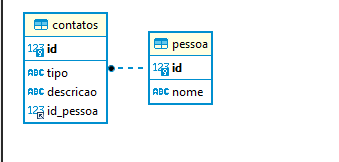

----------------------------------------------
# Projeto para teste técnico utilizando PHP e MySql

Esta aplicação funciona como uma agenda, onde pode-se armazenar "N" pessoas e para cada uma dessas pessoas "N" contatos.

Banco de dados hospedado pelo serviço em nuvem da plataforma heroku.

<p align="center">
  
</p>

Os scripts para criação das tabelas e uma primeira alimentação das mesmas está dentro da pasta "bancodedados" na raiz do projeto.

Foi utilizado o framework slim 3.1 para implementação das rotas entre as paginas e também entre as funcionalidades.

Projeto foi implementado usando PHP 5.6

Para instalação e execução do projeto, é necessário ter a mesma versão do PHP instalada e também o composer instalado.

Com ambos instalados, segue o passo a passo para deixar o projeto rodando:

```bash
# clone o repository
$ git clone https://github.com/paulovitornn/contatos.git

# com o composer já instalado na sua maquina vá para a pasta raiz do projeto e execute (pelo prompt)
$ composer install

# apos finalizar a instalação dos pacotes no projeto rode o seguinte comando (pelo prompt)
$ composer start

# na tela do prompt mostrará o endereço local para acessar o projeto.
```

### A questão 1 suportes balanceados.
Essa questão está implementada diretamente de forma simples dentro do arquivo /src/routes.php entre as linhas 62 e 89.


